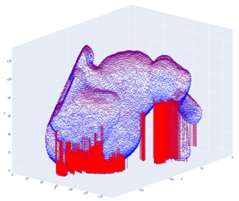
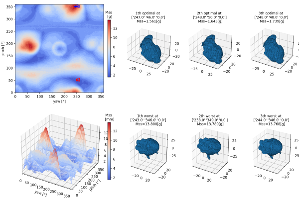

# TomoNV
#### Implementation of the submitted paper, "Prediction of optimal 3D printing orientation using vertically sparse voxelization and modified support structure tomography"

### Usage
#### 1. Install software
#####    (1) Install Visual Studio Code (VSCode)
#####    (2) Install Python 3 (preferably Version 3.7.8)
#####    (3) Install Python packages using "requirements.txt".
```
pip install -r requirements.txt
```
#####    (4) Install VC++ 2019 Redistributable package
( https://learn.microsoft.com/en-us/cpp/windows/latest-supported-vc-redist?view=msvc-170 ).

#### 2. Download all the files of this repository to your PC ("Code"->"Download Zip")

※ C++ DLL file ( TomoNV_Win64.dll, TomoNV_Win64.lib) is compiled for MS Windows 64bit. Its Visual C++ source code is at the "tomoNV_CppDLL_VS2019" folder.

#### 3. Open the downloaded folder in Visual Studio Code. Modify  mesh filename,  initial orientation and angle interval(=theta_YP) in "Cpp_example.py".  Run the "Cpp_example.py" (shortcut key, F5)

(1) To see the support structure information for the given (yaw, pitch, roll), set "theta_YP" as zero.
```
#=========================================================================================
(g_input_mesh_filename, Yaw, Pitch, Roll) = ('TomoNV_Data\\(4)Bunny_69k.stl', 247, 46, 0)
theta_YP = 0
#=========================================================================================
```


(2) To search optimal orientation, input "theta_yp" value as "360 / N " (where N = integer).
```
#=========================================================================================
(g_input_mesh_filename, Yaw, Pitch, Roll) = ('TomoNV_Data\\(4)Bunny_69k.stl', 0, 0, 0)
theta_YP = 5
#=========================================================================================
```


※ Python implementations (Python_Example1_singleOrientation.py, Python_Example2_searchOptimal.py) are rather old versions and can have some noises.


